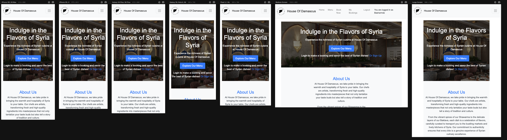
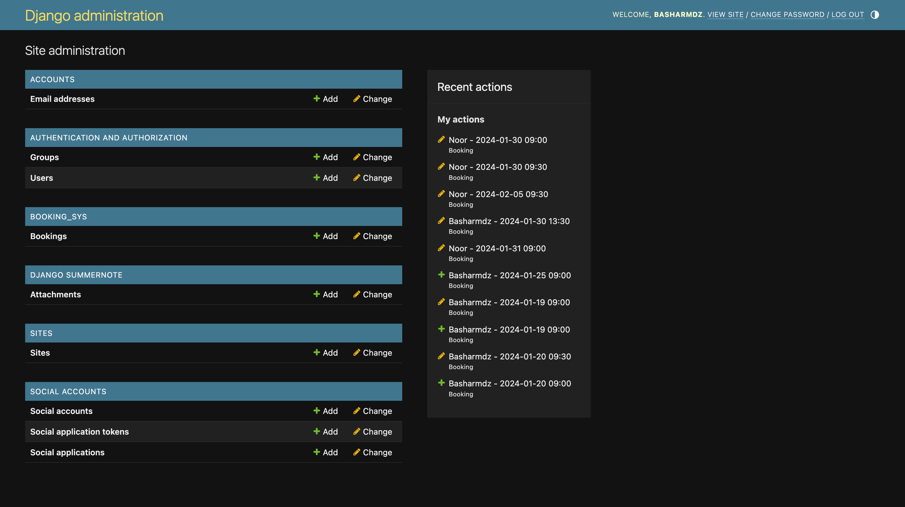
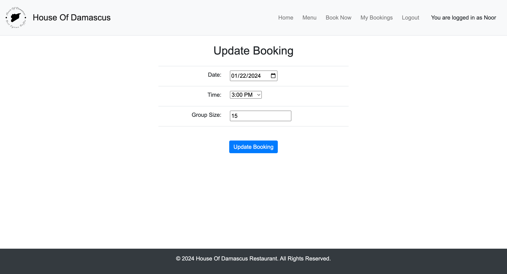
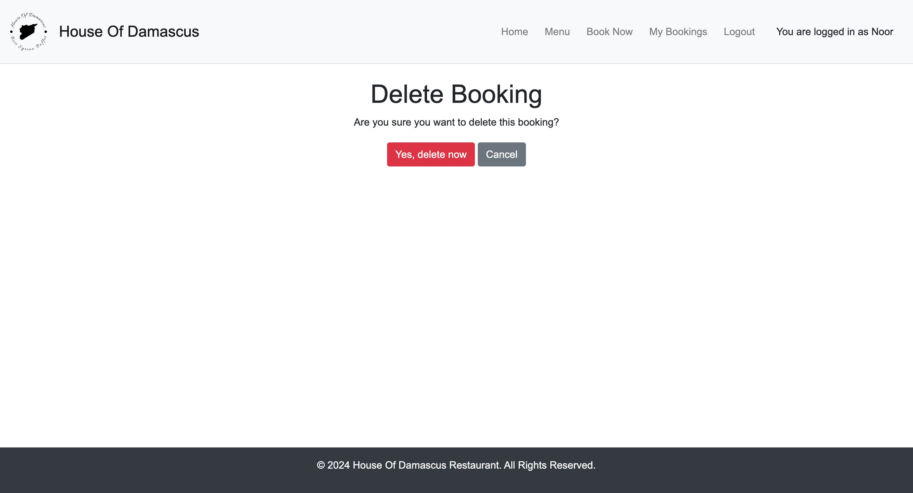
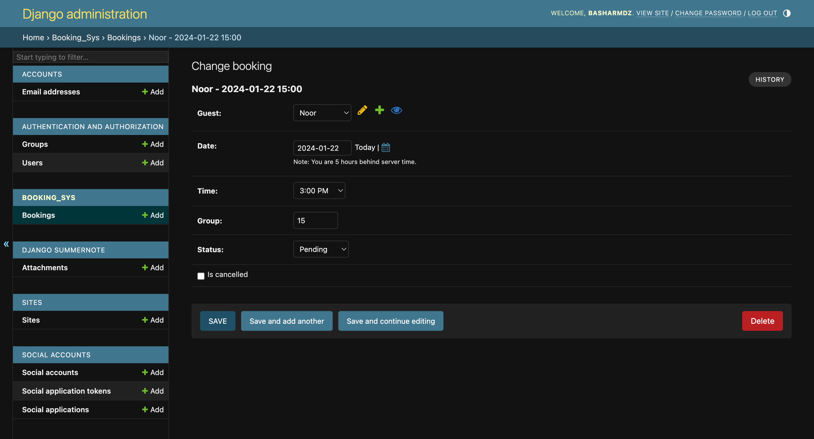
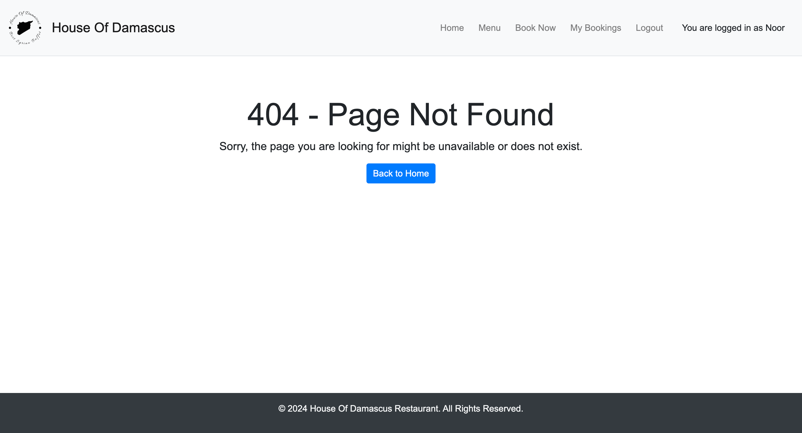
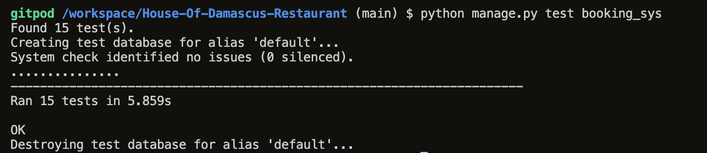
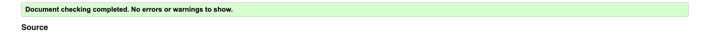
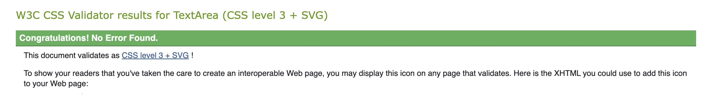

# House of Damascus Restaurant

## Project Overview

House of Damascus is a web application designed for a restaurant, offering users access to information about the restaurant, its menu, location, and an integrated booking system. Users can register, log in, make reservations, and review their booking history and edit them.

## Demo

Explore the live demo: [House of Damascus Demo](https://my-restaurant-booking-system-38d3a97041b0.herokuapp.com/)

## Table of Contents

- [Project Features](#project-features)
  - [Navbar](#navbar)
  - [Footer](#footer)
  - [Home Page](#home-page)
  - [Menu Page](#menu-page)
  - [Booking Admin](#booking-admin)
  - [Sign Up/In/Out Forms](#sign-upinout-forms)
  - [Booking Form](#booking-form)
  - [User Booking List](#user-booking-list)
  - [Booking Update Capabilities](#booking-update-capabilities)
  - [Booking Deletion Capabilities](#booking-deletion-capabilities)
  - [Booking Overview for Admin](#booking-overview-for-admin)
  - [Error Page](#error-page)
- [Design Process and Reasoning](#design-process-and-reasoning)
  - [Design Philosophy](#design-philosophy)
  - [Color Palette](#color-palette)
  - [Typography](#typography)
  - [Design Process](#design-process)
- [Models](#models)
  - [User Model](#user-model)
  - [Booking Model](#booking-model)
- [Database Schema](#database-schema)
  - [User](#user)
  - [Booking](#booking)
- [Features to be Implemented](#features-to-be-implemented)
- [Technology & Resources](#technology--resources)
  - [Technologies Used](#technologies-used)
  - [Packages Used](#packages-used)
  - [Reference Materials](#reference-materials)
- [Testing](#testing))
    - [Automated Testing](#automated-testing)
    - [Manual testing](#manual-testing)   
    - [Validator testing](#validator-testing)
    - [Unfixed Bugs](#unfixed-bugs)
- [Deployment](#deployment)
  - [Heroku Deployment](#heroku-deployment)
- [Credits](#credits)
    -[Content](#content)
    -[Media](#media)

## Project Features

### Navbar
The navigation bar adapts to the current site section, providing easy access to different pages. It remains fixed at the top of the screen for convenient navigation.

### Footer
A footer which displays copyrights for the website.

### Home Page
The home page welcomes users with restaurant opening times and a quick link to the booking area. Elements on the page adjust based on the device screen size.

### Menu Page
A static page showcases the restaurant's food and prices. The layout is responsive, switching from two to one-column design on smaller screens.

### Booking Admin
An admin area is accessible only by administrators, providing a link to view all booking entries in the database.

### Sign Up/In/Out Forms
User authentication is managed through sign-up, sign-in, and sign-out forms. The forms include necessary validation and links for a seamless user experience.

### Booking Form
The booking form, displayed upon signing in, allows users to select the date, time, and group size for a reservation. It includes restrictions on available days, times, and group sizes.

### User Booking List
After a successful booking, users can view their specific booking list. The list displays booking status and provides buttons for updating or deleting entries.

### Booking Update Capabilities
A button allows users to update details of a pending or confirmed booking. The form allows users to confirm or return without changes.

### Booking Deletion Capabilities
A button enables users to delete a booking, displaying details and a confirmation prompt. Users can confirm and delete or return without deletion.

### Booking Overview for Admin
An admin area includes a list of all bookings, with a dropdown option to set booking status as confirmed or canceled.

### Error Page
Custom error page 404 provide links back to valid areas of the site, enhancing user experience in case of errors.

## Design Process and Reasoning

### Design Philosophy

At House of Damascus, simplicity and clarity are prioritized. The design philosophy revolves around creating intuitive and user-friendly experiences that prioritize ease of use and accessibility. The design is clean, minimalist, and aesthetically pleasing to ensure that visitors can navigate the website effortlessly.

### Color Palette

The House of Damascus website employs a simple color palette consisting of white, gray, and black. These neutral colors were chosen for their versatility, allowing content and visuals to stand out without overwhelming the user. The use of white promotes a sense of cleanliness and spaciousness, while gray and black add depth and contrast to the overall design.

### Typography

For typography, the Arial font family was selected for its readability and familiarity. Arial offers a clean and modern look that complements the minimalist design aesthetic. Its simplicity ensures that content remains easy to read across different devices and screen sizes, enhancing the user experience.

### Design Process

The design process follows a systematic approach aimed at delivering a seamless and cohesive website experience. Here's an overview of the design process:

1. **Research**: Thorough research was conducted to understand the target audience, their preferences, and their expectations from a restaurant website with a booking system like House of Damascus.

2. **Conceptualization**: Based on research findings, various design ideas were brainstormed and conceptualized to align with the brand identity and user needs.

3. **Prototyping**: Wireframing and prototyping tools were used to create mockups visualizing the layout, structure, and functionality of the House of Damascus website.

4. **Feedback and Iteration**: Feedback was gathered from random users, incorporating suggestions and making iterative improvements to the design.

5. **Finalization**: After multiple rounds of refinement, the design was finalized, ensuring that it met objectives and satisfied the needs of the target audience.

By adhering to these principles and processes, House of Damascus has crafted a website that delivers a seamless and enjoyable user experience, reflecting the commitment to simplicity, clarity, and user-centric design.

## Models

### User

The `User` model is provided by Django's authentication system and represents registered users of the application.

**Fields:**

- `username`: CharField, representing the unique username of the user.
- `email`: EmailField, representing the email address of the user.
- `password`: CharField, representing the hashed password of the user.

**Relationships:**

- Each `User` can have multiple `Booking` objects associated with them.

### Booking

The `Booking` model represents a reservation made by a user for a specific date and time.

**Fields:**

- `guest`: ForeignKey to the User model, representing the user who made the booking.
- `date`: DateField, representing the date of the booking.
- `time`: CharField with choices, representing the time slot for the booking.
- `group`: PositiveIntegerField, representing the number of guests in the booking group.
- `status`: CharField with choices, representing the status of the booking (Pending, Confirmed, Cancelled).
- `is_cancelled`: BooleanField, indicating whether the booking has been cancelled.
- `created_on`: DateTimeField, representing the timestamp when the booking was created.

**Relationship:**

- Each `Booking` is associated with a single `User` who made the reservation.

**Methods:**

- `__str__`: Returns a string representation of the booking, including the guest's username, date, and time.

**Meta:**

- `ordering`: Specifies the default ordering of Booking objects by their creation timestamp.

## Database Schema

The database schema for the House of Damascus project is based on the following models:

### User Model

| Field     | Type          | Description                     |
|-----------|---------------|---------------------------------|
| id        | IntegerField  | Primary key                     |
| username  | CharField     | Unique username of the user     |
| email     | EmailField    | Email address of the user       |
| password  | CharField     | Hashed password of the user     |

### Booking Model

| Field        | Type            | Description                                       |
|--------------|-----------------|---------------------------------------------------|
| id           | IntegerField    | Primary key                                       |
| guest_id     | ForeignKey      | Foreign key referencing the User model            |
| date         | DateField       | Date of the booking                               |
| time         | CharField       | Time slot for the booking                         |
| group        | PositiveIntegerField | Number of guests in the booking group         |
| status       | CharField       | Status of the booking (Pending, Confirmed, Cancelled) |
| is_cancelled | BooleanField    | Indicates whether the booking has been cancelled |
| created_on   | DateTimeField   | Timestamp when the booking was created           |

## Features to be Implemented

The following features are identified as long-term goals to enhance user experience:

- Users can book without the need to log in.

## Technology & Resources

### Technologies Used

- **Python Modules:**
  -  asgiref==3.7.2
  -  dj-database-url==0.5.0
  -  Django==5.0.1
  -  django-allauth==0.57.0
  -  django-summernote==0.8.20.0
  -  gunicorn==20.1.0
  -  oauthlib==3.2.2
  -  psycopg2==2.9.9
  -  PyJWT==2.8.0
  -  python3-openid==3.2.0
  -  requests-oauthlib==1.3.1
  -  sqlparse==0.4.4
  -  whitenoise==5.3.0

- **Django:**
  - Main Python framework for project development.
  - django-allauth is used for managing user accounts in the booking system.
  - Jinga/Django templating is employed for queries to the database and inserting data onto site pages.

- **Deployment Platforms:**
  - [Heroku](https://heroku.com): Cloud-based deployment platform.
  - [ElephantSQL](https://elephantsql.com): Database hosting service.

- **Frontend Technologies:**
  - HTML: Base coding language for templates and site content.
  - [Bootstrap](https://getbootstrap.com/): Main design layout and formatting framework.
  - CSS: Modifications to Bootstrap behavior and additional custom stylings.

### Packages Used

- **Development Tools:**
  - [Gitpod](https://gitpod.io): IDE used for coding and file transfer between editor and repository.
  - [GitHub](https://github.com): Version control and repository hosting.
  - [Balsamiq](https://balsamiq.com/): Wireframe models for site design.
  - [DBDiagram](https://dbdiagram.io/): Database diagram creation tool.
  - [Google Fonts](https://fonts.google.com/): Styling the text throughout the site.
  - [Google Maps](https://www.google.com/maps): Creating a specific map for the Location page.
  - [Markdown Table Generator](https://jakebathman.github.io/Markdown-Table-Generator/): Creating tables for documentation.

### Reference Materials

- **Documentation:**
  - [Django Documentation](https://docs.djangoproject.com/en/4.2/ref/class-based-views/generic-editing/): Reference for achieving CRUD functionality and associated views.
  - [Django-allauth Documentation](https://docs.allauth.org/en/latest/): Guide for implementing authentication features correctly.
  - [Code Institute](https://codeinstitute.net/): Course help to create the project.

## Testing

### Automated Testing

Automated testing was conducted to ensure the functionality and integrity of the project. The testing process included the following:

- **Reservation Form Testing:**
  - The reservation form was tested with various scenarios, including minimum and maximum group sizes, past dates and times, and invalid time values.

- **Access Control Tests:**
  - Views that require authentication were tested to ensure they are not accessible to unauthenticated users.

- **Permissions Tests:**
  - Tests were conducted to verify that only the booking owner can update or delete their booking.

- **Error Handling Tests:**
  - The application's handling of unexpected errors, such as database connection issues, was tested.

- **Template Rendering Tests:**
  - Tests were added to ensure the correct templates are being used to render views.

- **Custom 404 View Test:**
  - The custom 404 view was tested to ensure it renders the correct template.

- **Update Own Booking Test:**
  - The ability of a user to update their own booking was tested.

- **Update Other User's Booking Test:**
  - The prevention of a user updating another user's booking was tested.

- **Delete Own Booking Test:**
  - The ability of a user to delete their own booking was tested.

- **Delete Other User's Booking Test:**
  - The prevention of a user deleting another user's booking was tested.

- **User Authentication Test:**
  - The authentication of users and access to certain views was tested.

- **User Authorization Test:**
  - The prevention of users updating or deleting bookings created by other users was tested.

- **Date and Time Availability Test:**
  - The handling of date and time availability to prevent double bookings was tested.

- **Error Handling Scenarios Test:**
  - The application's response to various error scenarios, including 404 pages and form validation errors, was tested.

- **Date and Time Availability Test:**
  - The handling of date and time availability to prevent double bookings was tested.

### Manual Testing

#### Booking System

1. **Create a Booking:**
   - Navigate to the booking form page.
   - Enter valid details such as date, time, and group size.
   - Submit the form and verify that the booking is successfully created.

2. **View Bookings:**
   - Log in as a registered user.
   - Navigate to the booking list page.
   - Verify that all bookings associated with the logged-in user are displayed.

3. **Update Booking:**
   - Log in as the user who created the booking.
   - Navigate to the booking update page for the desired booking.
   - Modify the booking details and submit the form.
   - Verify that the booking details are updated accordingly.

4. **Delete Booking:**
   - Log in as the user who created the booking.
   - Navigate to the booking list page.
   - Click on the delete button for the desired booking.
   - Confirm the deletion and verify that the booking is removed from the list.

5. **Error Handling:**
   - Access non-existent pages and verify that the custom 404 page is displayed.
   - Submit forms with invalid data and verify that appropriate error messages are shown.

#### User Authentication and Authorization

1. **Login Functionality:**
   - Navigate to the login page.
   - Enter valid credentials and submit the form.
   - Verify that the user is redirected to the home page after successful login.

2. **Access Control:**
   - Attempt to access restricted pages without logging in.
   - Verify that the user is redirected to the login page.

3. **User Permissions:**
   - Attempt to perform actions such as updating or deleting bookings created by other users.
   - Verify that the user receives a permission denied error message.

#### Date and Time Availability

1. **Prevent Double Bookings:**
   - Create a booking for a specific date and time.
   - Attempt to create another booking for the same date and time.
   - Verify that the second booking is rejected due to availability constraints.

### Validator testing

The project was tested using the W3C Markup Validation Service and W3C CSS Validation Service to ensure that the code meets industry standards.

- [W3C Markup Validation Service](https://validator.w3.org/): Ensures HTML code validity.
    
- [W3C CSS Validation Service](https://jigsaw.w3.org/css-validator/): Checks the validity of CSS code.
    
### Unfixed Bugs

Google Chrome sometimes shows that the website is unsafe, a request to Google was sent to fix this issue.

## Deployment

### Heroku Deployment

This project was deployed to Heroku using these steps:

  1. Create a Heroku account and install the Heroku CLI.
  2. Initialize a Git repository in your project folder (`git init`).
  3. Log in to Heroku CLI (`heroku login`) and create a new Heroku app (`heroku create`).
  4. Set up Heroku PostgreSQL as the database (`heroku addons:create heroku-postgresql`).
  5. Push your code to the Heroku remote (`git push heroku master`).
  6. Run migrations and set up the database (`heroku run python manage.py migrate`).
  7. Deploy your app to Heroku (`git push heroku master`).
  8. Application should now be deployed and accessible via the provided Heroku app URL.

## Credits

### Content

The content for this website was generated using the following tools:

- **ChatGPT:** Used for generating and refining website content to ensure clear and informative text.
- **Grammarly:** Employed for proofreading and enhancing the overall writing quality.

The combination of these tools contributed to creating engaging and error-free content for the House of Damascus Restaurant website.

### Media

- **Favicon:**
  ![Favicon] [Image Credit](https://www.logoai.com/logo-maker)

- **Background Image:**
  ![Background Image][Image Credit](https://www.deviantart.com/edibetaawo/art/Islamic-Muslim-Background-Gacha-986753632)

- **Menu Images:**
  - Breakfast Buffet
    ![Breakfast Buffet][Image Credit](https://www.myrecipes.com/extracrispy/the-many-marvels-of-full-syrian-breakfast)
  - Lunch Buffet
    ![Lunch Buffet][Image Credit](https://www.facebook.com/p/Sandwich-Falafel-Abu-Alnur-Syrein-100054640261068/)
  - Dinner Buffet
    ![Dinner Buffet][Image Credit](https://njmonthly.com/articles/eat-drink/syria-supper-club-the-universal-language/)