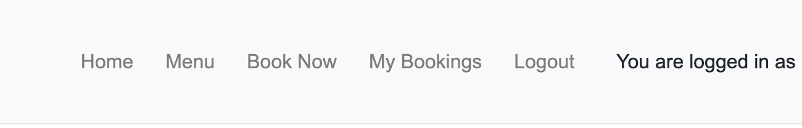
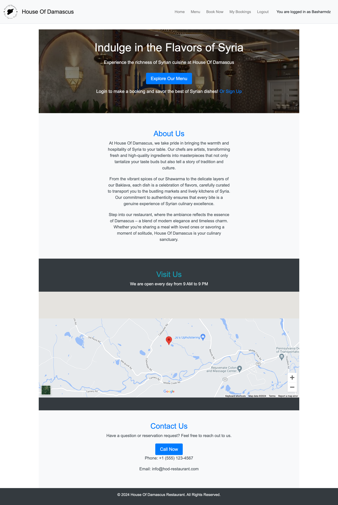
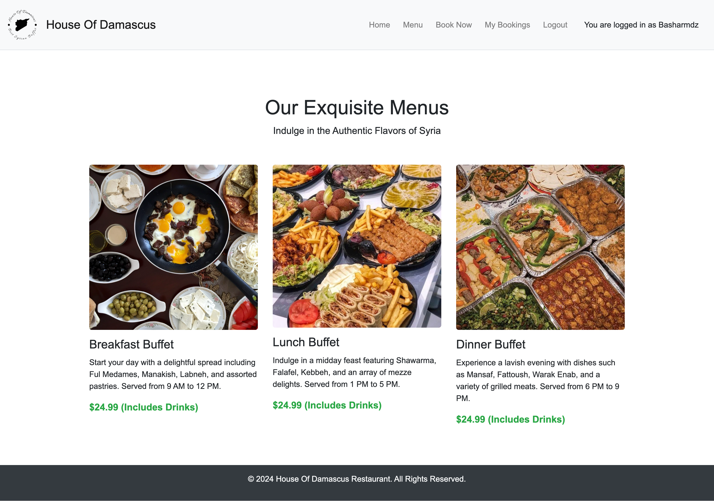
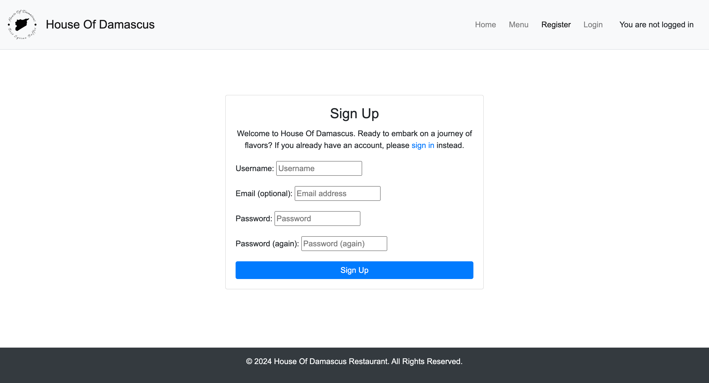
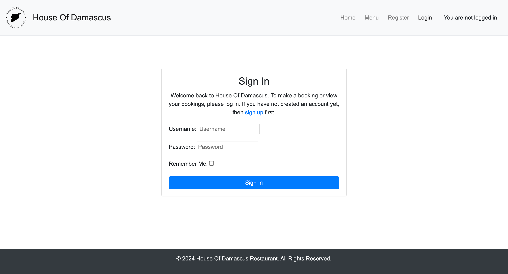
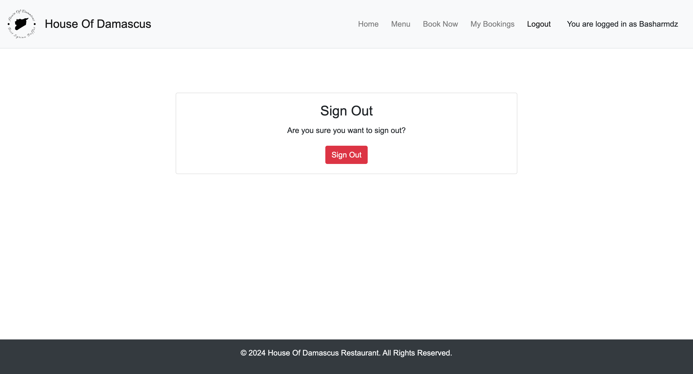
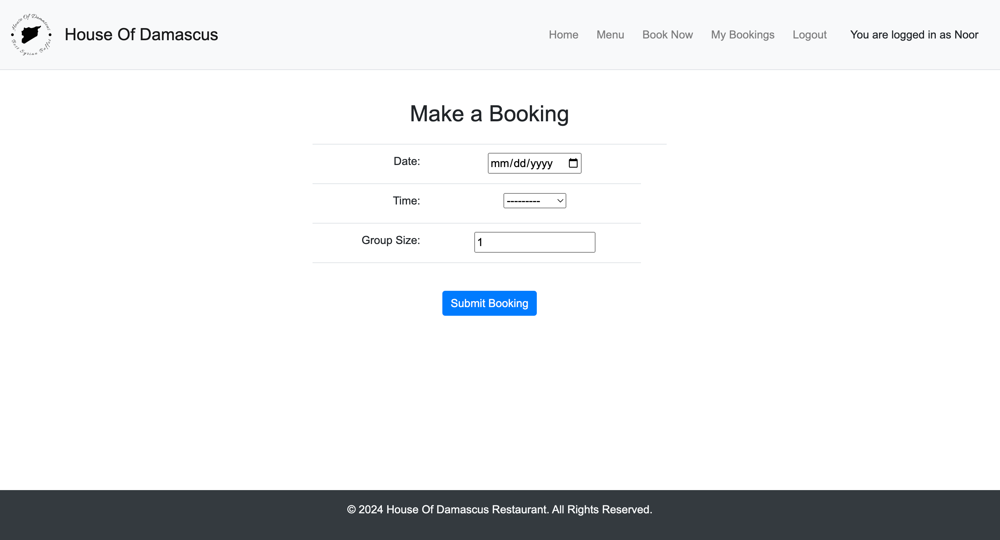
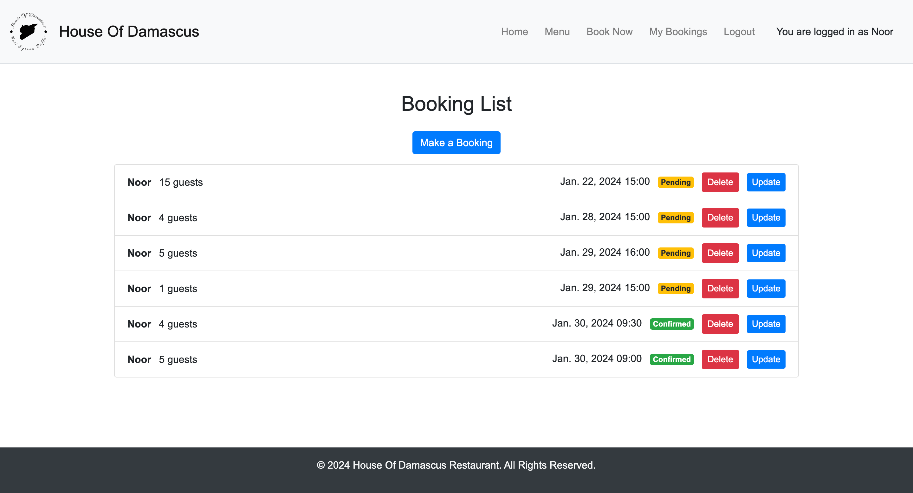

# House of Damascus Restaurant

## Project Overview

House of Damascus is a web application designed for a restaurant, offering users access to information about the restaurant, its menu, location, and an integrated booking system. Users can register, log in, make reservations, and review their booking history and edit them.

## Demo

Explore the live demo: [House of Damascus Demo](https://my-restaurant-booking-system-38d3a97041b0.herokuapp.com/)

## Table of Contents

- [Project Features](#project-features)
  - [Navbar](#navbar)
  - [Footer](#footer)
  - [Home Page](#home-page)
  - [Menu Page](#menu-page)
  - [Booking Admin](#booking-admin)
  - [Sign Up/In/Out Forms](#sign-upinout-forms)
  - [Booking Form](#booking-form)
  - [User Booking List](#user-booking-list)
  - [Booking Update Capabilities](#booking-update-capabilities)
  - [Booking Deletion Capabilities](#booking-deletion-capabilities)
  - [Booking Overview for Admin](#booking-overview-for-admin)
  - [Error Page](#error-page)
- [Features to be Implemented](#features-to-be-implemented)
- [Technology & Resources](#technology--resources)
  - [Technologies Used](#technologies-used)
  - [Packages Used](#packages-used)
  - [Reference Materials](#reference-materials)
- [Testing](#testing))
    - [Validator testing](#validator-testing)
    - [Unfixed Bugs](#unfixed-bugs)
- [Deployment](#deployment)
  - [Heroku Deployment](#heroku-deployment)
- [Credits](#credits)
    -[Content](#content)
    -[Media](#media)

## Project Features

### Navbar
The navigation bar adapts to the current site section, providing easy access to different pages. It remains fixed at the top of the screen for convenient navigation.

### Footer
A footer which displays copyrights for the website.

### Home Page
The home page welcomes users with restaurant opening times and a quick link to the booking area. Elements on the page adjust based on the device screen size.

### Menu Page
A static page showcases the restaurant's food and prices. The layout is responsive, switching from two to one-column design on smaller screens.

### Booking Admin
An admin area is accessible only by administrators, providing a link to view all booking entries in the database.

### Sign Up/In/Out Forms
User authentication is managed through sign-up, sign-in, and sign-out forms. The forms include necessary validation and links for a seamless user experience.

### Booking Form
The booking form, displayed upon signing in, allows users to select the date, time, and group size for a reservation. It includes restrictions on available days, times, and group sizes.

### User Booking List
After a successful booking, users can view their specific booking list. The list displays booking status and provides buttons for updating or deleting entries.

### Booking Update Capabilities
A button allows users to update details of a pending or confirmed booking. The form warns about resetting confirmed bookings to pending and allows users to confirm or return without changes.

### Booking Deletion Capabilities
A button enables users to delete a booking, displaying details and a confirmation prompt. Users can confirm and delete or return without deletion.

### Booking Overview for Admin
An admin area includes a list of all bookings, with a dropdown option to set booking status as confirmed or canceled.

### Error Page
Custom error page 404 provide links back to valid areas of the site, enhancing user experience in case of errors.

## Features to be Implemented

The following features are identified as long-term goals to enhance user experience:

- Users can book without the need to log in.

## Technology & Resources

### Technologies Used

- **Python Modules:**
  -  asgiref==3.7.2
  -  dj-database-url==0.5.0
  -  Django==5.0.1
  -  django-allauth==0.57.0
  -  django-summernote==0.8.20.0
  -  gunicorn==20.1.0
  -  oauthlib==3.2.2
  -  psycopg2==2.9.9
  -  PyJWT==2.8.0
  -  python3-openid==3.2.0
  -  requests-oauthlib==1.3.1
  -  sqlparse==0.4.4
  -  whitenoise==5.3.0

- **Django:**
  - Main Python framework for project development.
  - django-allauth is used for managing user accounts in the booking system.
  - Jinga/Django templating is employed for queries to the database and inserting data onto site pages.

- **Deployment Platforms:**
  - [Heroku](https://heroku.com): Cloud-based deployment platform.
  - [ElephantSQL](https://elephantsql.com): Database hosting service.

- **Frontend Technologies:**
  - HTML: Base coding language for templates and site content.
  - [Bootstrap](https://getbootstrap.com/): Main design layout and formatting framework.
  - CSS: Modifications to Bootstrap behavior and additional custom stylings.

### Packages Used

- **Development Tools:**
  - [Gitpod](https://gitpod.io): IDE used for coding and file transfer between editor and repository.
  - [GitHub](https://github.com): Version control and repository hosting.
  - [Balsamiq](https://balsamiq.com/): Wireframe models for site design.
  - [DBDiagram](https://dbdiagram.io/): Database diagram creation tool.
  - [Google Fonts](https://fonts.google.com/): Styling the text throughout the site.
  - [Google Maps](https://www.google.com/maps): Creating a specific map for the Location page.
  - [Markdown Table Generator](https://jakebathman.github.io/Markdown-Table-Generator/): Creating tables for documentation.

### Reference Materials

- **Documentation:**
  - [Django Documentation](https://docs.djangoproject.com/en/4.2/ref/class-based-views/generic-editing/): Reference for achieving CRUD functionality and associated views.
  - [Django-allauth Documentation](https://docs.allauth.org/en/latest/): Guide for implementing authentication features correctly.
  - [Code Institute](https://codeinstitute.net/): Course help to create the project.

## Testing

### Automated Testing

Automated testing was conducted to ensure the functionality and integrity of the project. The testing process included the following:

- **Reservation Form Testing:**
  - The reservation form was tested with various scenarios, including minimum and maximum group sizes, past dates and times, and invalid time values.

- **Access Control Tests:**
  - Views that require authentication were tested to ensure they are not accessible to unauthenticated users.

- **Permissions Tests:**
  - Tests were conducted to verify that only the booking owner can update or delete their booking.

- **Error Handling Tests:**
  - The application's handling of unexpected errors, such as database connection issues, was tested.

- **Performance Tests:**
  - Performance testing was conducted to ensure the application scales well, especially with a large number of bookings.

- **Template Rendering Tests:**
  - Tests were added to ensure the correct templates are being used to render views.

- **Custom 404 View Test:**
  - The custom 404 view was tested to ensure it renders the correct template.

- **Menu View Test:**
  - The menu view was tested to ensure it renders successfully.

- **Pagination Test:**
  - If applicable, pagination in the BookListView was tested to ensure it displays the correct number of bookings per page.

- **Date Hierarchy Test:**
  - The ordering of bookings in the BookingList view based on the date_hierarchy in the admin was tested.

### Validator testing

The project was tested using the W3C Markup Validation Service and W3C CSS Validation Service to ensure that the code meets industry standards.

- [W3C Markup Validation Service](https://validator.w3.org/): Ensures HTML code validity.
- [W3C CSS Validation Service](https://jigsaw.w3.org/css-validator/): Checks the validity of CSS code.

### Unfixed Bugs

No unfixed Bugs were found

## Deployment

### Heroku Deployment

This project was deployed to Heroku using these steps:

    1. Fork or clone this repository
    2. Create a new Heroku app
    3. Set the buildpacks to Python
    4. Set the config vars for your database connection and api keys
    4. Link the Heroku app to the repository
    5. Click on deploy

## Credits

### Content

The content for this website was generated using the following tools:

- **ChatGPT:** Used for generating and refining website content to ensure clear and informative text.
- **Grammarly:** Employed for proofreading and enhancing the overall writing quality.

The combination of these tools contributed to creating engaging and error-free content for the House of Damascus Restaurant website.

### Media

- **Favicon:**
   [Image Credit](https://www.logoai.com/logo-maker)

- **Background Image:**
   [Image Credit](https://www.deviantart.com/edibetaawo/art/Islamic-Muslim-Background-Gacha-986753632)

- **Menu Images:**
  - Placeholder for Breakfast Buffet
     [Image Credit](https://www.myrecipes.com/extracrispy/the-many-marvels-of-full-syrian-breakfast)
  - Placeholder for Lunch Buffet
     [Image Credit](https://www.facebook.com/p/Sandwich-Falafel-Abu-Alnur-Syrein-100054640261068/)
  - Placeholder for Dinner Buffet
     [Image Credit](https://njmonthly.com/articles/eat-drink/syria-supper-club-the-universal-language/)

